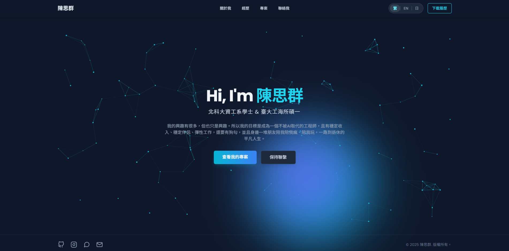

# Siqun Chen | 個人作品集網站

這是一個使用 React、TypeScript 和 Tailwind CSS 打造的現代化、響應式個人作品集網站。它不僅展示了我的技能、專案和經歷，還融入了多種酷炫的互動效果與動畫，提供流暢且引人入勝的使用者體驗。

**[➡️ 立即體驗](https://siqun-web.pages.dev/)**

## 📸 畫面預覽



---

## ✨ 主要功能

* **多國語言支援**: 提供繁體中文、英文、日文三種語言介面，可隨時切換。
* **酷炫的互動效果**:
    * **3D 全像方塊 (HoloCube)**: 在「關於我」頁面中，透過可拖曳旋轉的 3D 方塊展示多張個人照片。
    * **粒子動畫背景**: 首頁擁有動態的粒子連線背景，並能與滑鼠互動。
    * **客製化互動游標**: 精緻的圓點與外框游標，當懸停於可互動元件上時會有放大效果。
    * **文字擾動效果 (Scramble Text)**: 導覽列和標題的文字在滑鼠懸停時會產生科幻電影般的打字擾動效果。
* **響應式設計**: 在各種裝置（電腦、平板、手機）上都能完美呈現。
* **元件化架構**:
    * **關於我**: 包含個人簡介、技能條、證照輪播牆、榮譽獎項和興趣卡片。
    * **經歷**: 以未來感十足的時間軸展示學歷、工作與幹部經歷。
    * **專案**: 以卡片形式陳列專案，點擊圖片可放大查看詳細資訊。
    * **聯絡我**: 簡潔明瞭的聯絡方式卡片。
* **平滑滾動動畫**: 當頁面滾動時，各區塊會以優雅的淡入和位移動畫呈現。

---

## 🛠️ 使用技術

* **前端框架**: React
* **語言**: TypeScript
* **打包工具**: Vite
* **CSS 框架**: Tailwind CSS
* **路由**: React Router
* **多國語言實現**: React Context API

---

## 🚀 如何在本機運行

**事前準備:** 請確保您的電腦已安裝 [Node.js](https://nodejs.org/)。

1.  **複製專案庫**:
    ```bash
    git clone [https://github.com/SiQunChen/siqun-web.git](https://github.com/SiQunChen/siqun-web.git)
    cd siqun-web
    ```

2.  **安裝依賴套件**:
    ```bash
    npm install
    ```

3.  **設定環境變數**:
    複製 `.env.local.example` 並重新命名為 `.env` (如果專案中有提供的話)。
    ```
    GEMINI_API_KEY=YOUR_API_KEY
    ```

4.  **啟動開發伺服器**:
    ```bash
    npm run dev
    ```

    應用程式將會運行在 `http://localhost:3000`。

---
